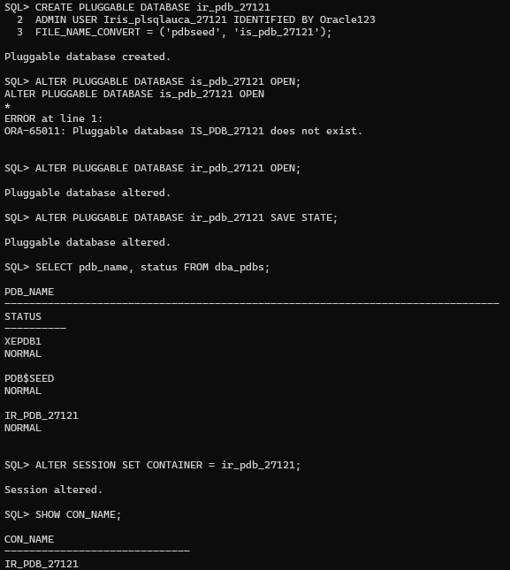
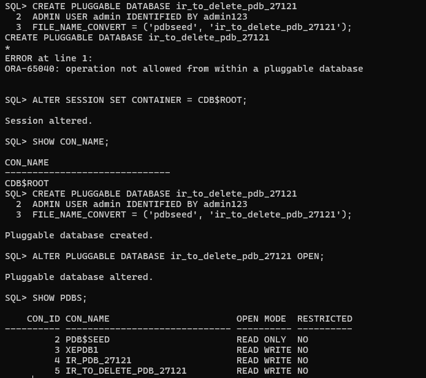

# Oracle Pluggable Database Assignment Report

**Student Name:** Isimbi Mushimire Iris  
**Student ID:** 27121
---

## Overview of Tasks

This assignment demonstrates practical skills in Oracle Database Multitenant Architecture through three main tasks:

### Task 1: Create Main Pluggable Database (PDB)
Created a PDB named `ir_pdb_27121` with admin user `Iris_plsqlauca_27121`. This PDB will store all class work throughout the semester.

### Task 2: Create and Delete Temporary PDB
Created a second PDB named `ir_to_delete_pdb_27121`, then successfully deleted it including all datafiles to demonstrate PDB lifecycle management.

### Task 3: Oracle Enterprise Manager Configuration
Configured Oracle Enterprise Manager (EM Express) and verified both tasks through the web-based dashboard, confirming the main PDB exists and the temporary PDB was properly removed.

---

## Screenshots

### 1. Task 1: PDB Creation
 
*This screenshot shows the successful creation of the main PDB `ir_pdb_27121`. The commands executed include creating the PDB with the admin user, opening it, and verifying its status using SHOW PDBS.*

---

### 2. Task 2: Temporary PDB Creation and Deletion

*This screenshot demonstrates the creation of `ir_to_delete_pdb_27121` and its subsequent deletion. The output shows the PDB being closed, dropped with datafiles, and verification that it no longer appears in the PDB list.*

---

### 3. Task 3: Oracle Enterprise Manager - Dashboard

*This screenshot shows the Oracle Enterprise Manager Express dashboard accessed via web browser at https://localhost:5500/em. The username (SYS) is clearly visible, confirming successful login and configuration.*

---

### 4. Task 3: PDB Verification in OEM

*This screenshot shows the Pluggable Databases section in OEM, displaying `ir_pdb_27121` in OPEN status. Notably, the deleted PDB `ir_to_delete_pdb_27121` does not appear, confirming successful deletion.

## Conclusion

This assignment successfully demonstrated key Oracle Database multitenant architecture concepts:

✅ **PDB Creation:** Successfully created a functional pluggable database with proper naming conventions and admin credentials

✅ **PDB Deletion:** Properly closed and dropped a PDB including all datafiles, demonstrating clean resource management

✅ **EM Express:** Configured and utilized Oracle's web-based management tool for visual verification

### Key Skills Gained
- Understanding of CDB vs PDB architecture
- Proper container context management
- PDB lifecycle operations (create, open, close, drop)
- Oracle Enterprise Manager configuration and navigation
- SQL*Plus command-line proficiency

### Technical Achievements
- Main PDB: `ir_pdb_27121` (OPEN and operational)
- Admin User: `Iris_plsqlauca_27121` (created successfully)
- EM Express: Configured on port 5500 (accessible and functional)
- Clean Deletion: Temporary PDB removed with all datafiles

This hands-on experience with Oracle's multitenant architecture provides a solid foundation for future database administration tasks and multi-tenant environment management.
